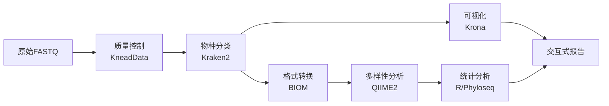

# MICOS-2024: 宏基因组综合分析套件
*Metagenomic Intelligence and Comprehensive Omics Suite*

<div align="center">


[](https://opensource.org/licenses/MIT)
[](https://hub.docker.com/)
[](https://openwdl.org/)
[](https://qiime2.org/)
[](https://ccb.jhu.edu/software/kraken2/)
[](https://github.com/BGI-MICOS/MICOS-2024)

**2024“猛犸杯”国际生命科学数据创新大赛 · 参赛作品**

[关于猛犸杯](#关于猛犸杯大赛) • [快速开始](#快速开始) • [核心功能](#核心功能) • [安装指南](#安装指南) • [文档](#文档)

</div>

---

## 关于“猛犸杯”大赛

### 大赛简介

**“猛犸杯”国际生命科学数据创新大赛**是由华大生命科学研究院、深圳国家基因库等机构联合主办的国际性生物信息学竞赛。大赛面向全球招募参赛者，不限年龄、国籍和职业，旨在推动多组学分析工具和算法的快速发展，降低工具使用门槛，促进生命科学领域的创新和发展。大赛秉持**以赛促训、以赛促学、以赛促教、以赛促创**的理念，通过比赛激发创新思维与实践能力，推动科研与教育的深度融合。

### 2024 届赛事信息

| 项目 | 详情 |
|:---|:---|
| **全称** | 2024“猛犸杯”国际生命科学数据创新大赛——多组学生信开发者挑战赛 |
| **简称** | 2024“猛犸杯”大赛—生信开发者挑战赛 |
| **主办方** | 华大生命科学研究院、深圳国家基因库、崖州湾科技城管理局 |
| **支持单位** | 国际数据委员会（CODATA）、国家超算互联网、崖州湾国家实验室 |
| **参赛对象** | 全球高校、科研院所、企业从业人员等 |
| **竞赛类别** | 健康生命 & 医学、程序设计、大数据、计算机 & 信息技术 |
| **比赛平台** | [STOmics Cloud](https://cloud.stomics.tech) |
| **赛事页面** | [赛氪](https://www.saikr.com/MICOS2024) · [DataCastle](https://mjs.datacastle.cn/cmptDetail.html?id=860) |

### 2024 届时间安排

| 阶段 | 时间 |
|:---|:---|
| **初赛** | 2024年5月15日 — 2024年8月15日 |
| **初赛评审** | 2024年8月16日 — 2024年9月14日 |
| **线上公投** | 2024年9月18日 — 2024年10月8日 |
| **线下决赛** | 2024年10月24日（海南） |

### 2024 届赛题

> **背景**：在新时代背景下，生命科学领域的多组学技术成为了推动生物医学、疾病防控、农业育种和种植、环境监测等领域发展的重要工具。随着空间组学、单细胞组学和基因组学等前沿技术的飞速发展，多组学工具和应用在维度、深度、广度上都有了很大提升和发展。然而，由于开发语言、环境和封装等差异的原因，科研人员与高校学生在探索多组学数据分析时，常遭遇分析工具开发困难、工具使用门槛高的挑战。

**赛题要求**：参赛选手在参赛平台上进行多组学工具的开发，创建和共享具有**应用价值大、影响力高、易用性好**的工具或工具系列。

**大赛目标**：
1. **激发创新思维** — 鼓励参赛者在多组学技术领域进行创新工具和算法研究
2. **提升技术水平** — 通过比赛提升参赛者的多组学技术水平和实践能力，培养高层次科研人才
3. **推动科教融合** — 促进科学研究与教育教学的融合，推动从科研到教育的全链条发展

**奖项设置**：作品提交奖、初赛人气奖、决赛奖

### 本项目与猛犸杯

MICOS-2024（Metagenomic Intelligence and Comprehensive Omics Suite）是参加 2024 届“猛犸杯”大赛的参赛作品，聚焦**宏基因组学**方向。项目整合了 Kraken2、QIIME2、KneadData 等主流工具，基于 WDL 工作流和 Docker 容器化，提供从原始测序数据到生物学洞察的**完整、可重现、易用**的分析流程。

---

## 项目概述

MICOS-2024 是一个专为宏基因组学研究设计的综合分析平台，解决宏基因组数据分析中的**复杂性**和**可重现性**挑战。平台整合多个经过验证的生物信息学工具，覆盖质控、物种分类、多样性分析、差异丰度分析、功能注释等完整流程。

### 主要特性

- **标准化工作流**：基于WDL的可重现分析流程
- **容器化部署**：Docker/Singularity支持，确保环境一致性
- **模块化设计**：灵活的分析组件，支持自定义流程
- **多样化输出**：丰富的可视化图表和统计报告
- **高性能计算**：优化的并行处理，支持HPC环境

## 核心功能

### 分析流程


```mermaid
graph LR
    A[原始FASTQ] --> B[质量控制<br/>KneadData]
    B --> C[物种分类<br/>Kraken2]
    C --> D[格式转换<br/>BIOM]
    D --> E[多样性分析<br/>QIIME2]
    C --> F[可视化<br/>Krona]
    E --> G[统计分析<br/>R/Phyloseq]
    F --> H[交互式报告]
    G --> H
```

### 主要组件

| 功能模块 | 工具 | 版本 | 描述 |
|:---:|:---:|:---:|:---|
| **质量控制** | KneadData/FastQC | v0.12.0 | 宿主DNA去除和序列质量过滤 |
| **增强质量控制** | 自定义Python模块 | v1.0.0 | 高级质量评估和可视化 |
| **物种分类** | Kraken2 | v2.1.3 | 基于k-mer的快速分类学分类 |
| **多样性分析** | QIIME2 | 2024.5 | Alpha/Beta多样性计算和统计检验 |
| **差异丰度分析** | DESeq2/ALDEx2/ANCOM-BC | - | 多种差异分析方法 |
| **功能注释** | KEGG/COG/Pfam | - | 功能基因注释和通路分析 |
| **系统发育分析** | FastTree/MUSCLE | - | 系统发育树构建和分析 |
| **16S rRNA分析** | DADA2/QIIME2 | - | 扩增子序列分析流程 |
| **宏转录组分析** | Salmon/DESeq2 | - | RNA-seq数据分析和功能注释 |
| **网络分析** | NetworkX/igraph | - | 微生物共现网络构建和分析 |
| **可视化** | Krona/Plotly | v2.8.1 | 交互式分类学组成图表 |
| **统计分析** | R/Phyloseq | - | 高级统计分析和可视化 |

### 技术特性

- **工作流管理**：WDL工作流引擎，支持断点续传和错误恢复
- **并行计算**：多线程处理，支持HPC集群部署
- **容器化**：Docker/Singularity支持，确保环境隔离
- **可扩展性**：模块化设计，便于集成新的分析工具
- **可重现性**：版本锁定和容器化确保结果一致性
- **标准兼容**：输出格式兼容QIIME2、Phyloseq、LEfSe等主流工具

## 性能基准

| 数据集规模 | 样本数量 | 处理时间 | 内存使用 |
|:---:|:---:|:---:|:---:|
| 小型 | 10个样本 | ~2小时 | 16GB |
| 中型 | 50个样本 | ~8小时 | 32GB |
| 大型 | 100个样本 | ~15小时 | 64GB |

*基准测试基于标准Kraken2数据库，使用16核CPU环境*

## 快速开始

### 系统要求

- **操作系统**: Linux (Ubuntu 20.04+) 或 macOS
- **内存**: 最少16GB，推荐32GB+
- **存储**: 至少100GB可用空间
- **CPU**: 多核处理器，推荐16核+

### Docker安装（推荐）

```bash
# 克隆项目
git clone https://github.com/BGI-MICOS/MICOS-2024.git
cd MICOS-2024

# 启动核心分析服务（示例 Compose）
docker compose -f deploy/docker-compose.example.yml up -d

# 运行测试
./scripts/run_test_data.sh
```

### Conda安装

```bash
# 安装Miniforge
wget https://github.com/conda-forge/miniforge/releases/latest/download/Miniforge3-Linux-x86_64.sh
bash Miniforge3-Linux-x86_64.sh

# 创建环境
git clone https://github.com/BGI-MICOS/MICOS-2024.git
cd MICOS-2024
mamba env create -f environment.yml
conda activate micos-2024

# 验证安装
./scripts/verify_installation.sh
```

## 项目结构 (Project Structure)

```
.
├── micos/                  # 核心 Python 包（质控、物种分类、多样性分析、功能注释等）
├── scripts/                # 运行脚本与分析模块（Shell / Python / R）
│   ├── run_full_analysis.sh    # 一键运行完整分析
│   ├── run_module.sh           # 按模块运行分析
│   ├── verify_installation.sh  # 验证安装环境
│   ├── enhanced_qc.py          # 增强质控
│   ├── functional_annotation.py
│   ├── network_analysis.py
│   └── ...
├── steps/                  # 分步骤分析教程（01-09，从质控到统计分析）
├── workflows/              # WDL 工作流定义
│   └── wdl_scripts/            # 各版本 WDL 脚本和配置
├── config/                 # 配置模板（分析参数、数据库路径、样本元数据）
├── containers/singularity/ # Singularity 容器定义文件
├── deploy/                 # Docker Compose 部署配置
├── data/raw_input/         # 原始测序数据输入目录
├── docs/                   # 用户手册、配置指南、故障排除
├── tests/                  # 单元测试和集成测试
├── changelog/              # 版本更新日志
├── .github/                # GitHub Actions CI 和 Issue 模板
├── CITATION.md             # 引用信息
├── pyproject.toml          # Python 项目配置
├── requirements.txt        # Python 依赖
├── environment.yml         # Conda 环境配置
└── README.md
```

## 安装指南

详细的安装说明请参考：[📖 完整安装指南](docs/user_manual.md#详细安装指南)

### 数据库准备

MICOS-2024 需要以下参考数据库：

- Kraken2 数据库（用于物种分类）
- KneadData 数据库（用于宿主 DNA 去除）
- QIIME2 分类器（用于分类学注释）

请参考 `docs/configuration.md` 获取下载与准备指南，并根据 `config/databases.yaml.template` 填写本地路径。

## 配置

### 配置文件

```bash
config/
├── analysis.yaml        # 分析参数配置
├── databases.yaml       # 数据库路径配置
└── samples.tsv          # 样本元数据
```

### 快速配置

```bash
# 复制配置模板
cp config/analysis.yaml.template config/analysis.yaml
cp config/databases.yaml.template config/databases.yaml
cp config/samples.tsv.template config/samples.tsv

# 编辑配置文件
nano config/analysis.yaml
nano config/databases.yaml
nano config/samples.tsv
```

详细配置说明请参考：[⚙️ 配置指南](docs/configuration.md)

## 使用指南

### 基本用法

```bash
# 1. 准备数据
mkdir -p data/raw_input
cp /path/to/your/*.fastq.gz data/raw_input/

# 2. 配置分析参数
cp config/analysis.yaml.template config/analysis.yaml
# 编辑配置文件...

# 3. 运行完整分析
./scripts/run_full_analysis.sh

# 4. 查看结果
firefox results/reports/analysis_report.html
```

### 模块化运行

```bash
# 基础分析模块
./scripts/run_module.sh quality_control
./scripts/run_module.sh enhanced_qc
./scripts/run_module.sh taxonomic_profiling
./scripts/run_module.sh diversity_analysis

# 高级分析模块
./scripts/run_module.sh differential_abundance
./scripts/run_module.sh functional_annotation
./scripts/run_module.sh phylogenetic_analysis
./scripts/run_module.sh network_analysis

# 专业分析模块
./scripts/run_module.sh amplicon_analysis      # 16S rRNA分析
./scripts/run_module.sh metatranscriptome      # 宏转录组分析

# 可视化和报告
./scripts/run_module.sh visualization
./scripts/run_module.sh report_generation
```

### 工作流运行

```bash
# 使用WDL工作流
java -jar cromwell.jar run \
  workflows/wdl_scripts/meta-dev.wdl \
  --inputs config/analysis.json
```

详细使用说明请参考：[📖 用户手册](docs/user_manual.md)

## 输出结果

### 主要输出

| 类型 | 位置 | 描述 |
|:---:|:---:|:---|
| **分析报告** | `results/reports/` | HTML格式的交互式报告 |
| **质量控制** | `results/quality_control/` | FastQC和MultiQC报告 |
| **增强质量控制** | `results/enhanced_qc/` | 高级质量评估和可视化报告 |
| **物种分类** | `results/taxonomic_profiling/` | Kraken2分类结果和Krona图表 |
| **多样性分析** | `results/diversity_analysis/` | Alpha/Beta多样性指标和图表 |
| **差异丰度分析** | `results/differential_abundance/` | DESeq2/ALDEx2/ANCOM-BC结果 |
| **功能注释** | `results/functional_annotation/` | KEGG/COG/Pfam注释结果 |
| **系统发育分析** | `results/phylogenetic_analysis/` | 系统发育树和进化分析 |
| **16S rRNA分析** | `results/amplicon_analysis/` | 扩增子序列分析结果 |
| **宏转录组分析** | `results/metatranscriptome/` | RNA-seq分析和功能注释 |
| **网络分析** | `results/network_analysis/` | 微生物共现网络和拓扑分析 |
| **统计表格** | `results/tables/` | CSV/TSV格式的数据表 |

### 可视化输出

- **Krona交互式图表**: 分类学组成的层次结构展示
- **多样性分析图**: Alpha/Beta多样性箱线图和PCoA图
- **丰度热图**: 样本间物种丰度比较
- **差异分析图**: 火山图、MA图和差异物种热图
- **功能注释图**: KEGG通路图和GO富集分析
- **系统发育树**: 交互式系统发育树可视化
- **网络图**: 微生物共现网络和模块分析
- **质量控制图**: 序列质量、GC含量和复杂度分析
- **统计检验结果**: 差异分析和生物标志物发现

## 文档

| 文档 | 描述 |
|:---|:---|
| [用户手册](docs/user_manual.md) | 完整的安装和使用指南 |
| [配置指南](docs/configuration.md) | 详细的配置参数说明 |
| [故障排除](docs/troubleshooting.md) | 常见问题和解决方案 |
| [分类学分析](docs/taxonomic-profiling.md) | 物种分类分析流程 |

## 贡献

我们欢迎社区贡献！请查看 [贡献指南](CONTRIBUTING.md) 了解详情。

- **报告问题**: [提交Issue](https://github.com/BGI-MICOS/MICOS-2024/issues)
- **功能建议**: [提交Feature Request](https://github.com/BGI-MICOS/MICOS-2024/issues)
- **代码贡献**: Fork项目并提交Pull Request

## 获取帮助

- **GitHub Issues**: [报告问题](https://github.com/BGI-MICOS/MICOS-2024/issues)
- **GitHub Discussions**: [参与讨论](https://github.com/BGI-MICOS/MICOS-2024/discussions)
- **故障排除**: [查看常见问题](docs/troubleshooting.md)
- **安全策略**: 查看 `SECURITY.md`

## 许可证

本项目采用 [MIT许可证](LICENSE)。

## 致谢

感谢华大生命科学研究院、深圳国家基因库、崖州湾科技城管理局举办的“猛犸杯”国际生命科学数据创新大赛为本项目提供的平台和支持。

感谢以下开源项目：

- [Kraken2](https://ccb.jhu.edu/software/kraken2/) - 分类学分类
- [QIIME2](https://qiime2.org/) - 微生物组数据分析
- [KneadData](https://github.com/biobakery/kneaddata) - 质量控制
- [Krona](https://github.com/marbl/Krona) - 交互式可视化
- [DESeq2](https://bioconductor.org/packages/DESeq2/) - 差异丰度分析
- [Phyloseq](https://joey711.github.io/phyloseq/) - 微生物组生态分析

---

<div align="center">

**MICOS-2024** | 2024“猛犸杯”国际生命科学数据创新大赛参赛作品

[](https://github.com/BGI-MICOS/MICOS-2024)

</div>