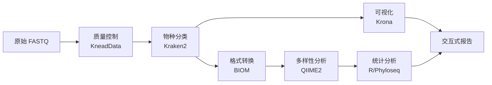

# MICOS-2024: 宏基因组综合分析套件

*Metagenomic Intelligence and Comprehensive Omics Suite*

<div align="center">

[](https://opensource.org/licenses/MIT)
[](https://hub.docker.com/)
[](https://openwdl.org/)
[](https://qiime2.org/)
[](https://ccb.jhu.edu/software/kraken2/)

**2024"猛犸杯"国际生命科学数据创新大赛 · 参赛作品**

[项目简介](#项目简介) • [核心功能](#核心功能) • [快速开始](#快速开始) • [使用指南](#使用指南) • [文档](#文档) • [关于猛犸杯](#关于猛犸杯大赛)

</div>

---

## 项目简介

MICOS-2024 是面向宏基因组学研究的端到端分析平台，整合 Kraken2、QIIME2、KneadData、HUMAnN 等主流工具，覆盖从原始测序数据到生物学洞察的完整流程。

- **标准化工作流** — 基于 WDL 的可重现分析流程，支持断点续传与错误恢复
- **容器化部署** — Docker / Singularity 支持，确保环境一致性与结果可重现
- **模块化设计** — 各分析组件可独立运行，也可按需组合为自定义流程
- **高性能计算** — 多线程并行处理，适配 HPC 集群环境
- **丰富的可视化输出** — Krona 交互式图表、多样性分析图、HTML 汇总报告

## 核心功能

### 分析流程


```mermaid
graph LR
    A[原始 FASTQ] --> B[质量控制<br/>KneadData]
    B --> C[物种分类<br/>Kraken2]
    C --> D[格式转换<br/>BIOM]
    D --> E[多样性分析<br/>QIIME2]
    C --> F[可视化<br/>Krona]
    E --> G[统计分析<br/>R/Phyloseq]
    F --> H[交互式报告]
    G --> H
```

### 功能模块

| 模块 | 工具 | 说明 |
|:---|:---|:---|
| 质量控制 | KneadData / FastQC | 宿主 DNA 去除、序列质量过滤 |
| 物种分类 | Kraken2 + kraken-biom + Krona | 基于 k-mer 的快速分类与可视化 |
| 多样性分析 | QIIME2 | Alpha / Beta 多样性计算 |
| 功能注释 | HUMAnN | 功能基因注释与通路分析 |
| 结果汇总 | Python | HTML 报告生成 |

> `scripts/` 目录还提供以下独立分析脚本（尚未集成到核心 CLI）：
> 差异丰度分析（R/DESeq2）、系统发育分析、16S rRNA 分析、宏转录组分析、网络分析。

## 快速开始

### 系统要求

| 项目 | 最低要求 | 推荐配置 |
|:---|:---|:---|
| 操作系统 | Linux (Ubuntu 20.04+) / macOS | — |
| 内存 | 16 GB | 32 GB+ |
| 存储 | 100 GB 可用空间 | — |
| CPU | 多核处理器 | 16 核+ |

### Conda

```bash
# 安装 Miniforge（如尚未安装）
wget https://github.com/conda-forge/miniforge/releases/latest/download/Miniforge3-Linux-x86_64.sh
bash Miniforge3-Linux-x86_64.sh

# 创建环境并激活
git clone https://github.com/LessUp/micos-2024.git
cd micos-2024
mamba env create -f environment.yml
conda activate micos-2024

# 验证安装
./scripts/verify_installation.sh
```

## 使用指南

### 完整分析

```bash
# 1. 准备数据
mkdir -p data/raw_input
cp /path/to/your/*.fastq.gz data/raw_input/

# 2. 配置分析参数
cp config/analysis.yaml.template config/analysis.yaml
cp config/databases.yaml.template config/databases.yaml
cp config/samples.tsv.template config/samples.tsv
# 按需编辑配置文件...

# 3. 运行完整分析
./scripts/run_full_analysis.sh

# 4. 查看结果
firefox results/micos_summary_report.html
```

### 模块化运行

```bash
./scripts/run_module.sh quality_control       # 质量控制
./scripts/run_module.sh taxonomic_profiling   # 物种分类
./scripts/run_module.sh diversity_analysis    # 多样性分析
./scripts/run_module.sh functional_annotation # 功能注释
./scripts/run_module.sh summarize_results     # 结果汇总
```

### WDL 工作流

各分析步骤的 WDL 任务定义位于 `steps/` 目录（01–09），可用 Cromwell 等引擎运行：

```bash
java -jar cromwell.jar run \
  steps/03_taxonomic_profiling_kraken/kraken2.wdl \
  --inputs steps/03_taxonomic_profiling_kraken/kraken2.json
```

## 配置说明

### 配置文件

```
config/
├── analysis.yaml    # 分析参数
├── databases.yaml   # 数据库路径
└── samples.tsv      # 样本元数据
```

从模板复制后按需编辑：

```bash
cp config/analysis.yaml.template config/analysis.yaml
cp config/databases.yaml.template config/databases.yaml
cp config/samples.tsv.template config/samples.tsv
```

### 数据库准备

MICOS-2024 依赖以下参考数据库：

- **Kraken2 数据库** — 物种分类
- **KneadData 数据库** — 宿主 DNA 去除
- **QIIME2 分类器** — 分类学注释

下载与配置方法参见[配置指南](docs/zh/configuration.md)，路径填写参照 `config/databases.yaml.template`。

## 输出说明

| 类型 | 路径 | 说明 |
|:---|:---|:---|
| 汇总报告 | `results/micos_summary_report.html` | HTML 格式全流程报告 |
| 质量控制 | `results/quality_control/` | FastQC 与 KneadData 结果 |
| 物种分类 | `results/taxonomic_profiling/` | Kraken2 分类结果、BIOM 表、Krona 图表 |
| 多样性分析 | `results/diversity_analysis/` | Alpha / Beta 多样性指标 |
| 功能注释 | `results/functional_annotation/` | HUMAnN 功能注释结果 |

## 项目结构

```
.
├── micos/                  # 核心 Python 包（质控、分类、多样性、功能注释）
├── scripts/                # 运行脚本与独立分析模块（Shell / Python / R）
├── steps/                  # 分步骤 WDL 任务定义（01–09）
├── config/                 # 配置模板（分析参数、数据库路径、样本元数据）
├── containers/singularity/ # Singularity 容器定义
├── data/raw_input/         # 原始测序数据输入目录
├── docs/                   # VitePress 文档站（中文）
├── tests/                  # 单元测试与集成测试
└── .github/                # CI 与 Issue 模板
```

## 文档

| 文档 | 说明 |
|:---|:---|
| [快速开始](docs/zh/guides/getting-started.md) | 安装与使用入门 |
| [配置指南](docs/zh/configuration.md) | 配置参数详解 |
| [故障排除](docs/zh/troubleshooting.md) | 常见问题与解决方案 |
| [物种分类分析](docs/zh/analysis/taxonomic-profiling.md) | 分类分析流程说明 |
| [CLI 参考](docs/zh/reference/cli.md) | 命令行接口完整参考 |

## 关于"猛犸杯"大赛

### 大赛简介

**"猛犸杯"国际生命科学数据创新大赛**由华大生命科学研究院、深圳国家基因库等机构联合主办，面向全球招募参赛者，不限年龄、国籍和职业。大赛旨在推动多组学分析工具和算法的快速发展，降低工具使用门槛，促进生命科学领域的创新与发展，秉持**以赛促训、以赛促学、以赛促教、以赛促创**的理念。

### 2024 届赛事信息

| 项目 | 详情 |
|:---|:---|
| **全称** | 2024"猛犸杯"国际生命科学数据创新大赛——多组学生信开发者挑战赛 |
| **简称** | 2024"猛犸杯"大赛—生信开发者挑战赛 |
| **主办方** | 华大生命科学研究院、深圳国家基因库、崖州湾科技城管理局 |
| **支持单位** | 国际数据委员会（CODATA）、国家超算互联网、崖州湾国家实验室 |
| **参赛对象** | 全球高校、科研院所、企业从业人员等 |
| **竞赛类别** | 健康生命 & 医学、程序设计、大数据、计算机 & 信息技术 |
| **比赛平台** | [STOmics Cloud](https://cloud.stomics.tech) |
| **赛事页面** | [赛氪](https://www.saikr.com/MICOS2024) · [DataCastle](https://mjs.datacastle.cn/cmptDetail.html?id=860) |

### 2024 届时间安排

| 阶段 | 时间 |
|:---|:---|
| 初赛 | 2024 年 5 月 15 日 — 8 月 15 日 |
| 初赛评审 | 2024 年 8 月 16 日 — 9 月 14 日 |
| 线上公投 | 2024 年 9 月 18 日 — 10 月 8 日 |
| 线下决赛 | 2024 年 10 月 24 日（海南） |

### 2024 届赛题

> **背景**：在新时代背景下，生命科学领域的多组学技术成为了推动生物医学、疾病防控、农业育种和种植、环境监测等领域发展的重要工具。随着空间组学、单细胞组学和基因组学等前沿技术的飞速发展，多组学工具和应用在维度、深度、广度上都有了很大提升和发展。然而，由于开发语言、环境和封装等差异的原因，科研人员与高校学生在探索多组学数据分析时，常遭遇分析工具开发困难、工具使用门槛高的挑战。

**赛题要求**：参赛选手在参赛平台上进行多组学工具的开发，创建和共享具有**应用价值大、影响力高、易用性好**的工具或工具系列。

**大赛目标**：

1. **激发创新思维** — 鼓励参赛者在多组学技术领域进行创新工具和算法研究
2. **提升技术水平** — 通过比赛提升参赛者的多组学技术水平和实践能力，培养高层次科研人才
3. **推动科教融合** — 促进科学研究与教育教学的融合，推动从科研到教育的全链条发展

**奖项设置**：作品提交奖、初赛人气奖、决赛奖

### 本项目与猛犸杯

MICOS-2024 是参加 2024 届"猛犸杯"大赛的参赛作品，聚焦**宏基因组学**方向。项目整合 Kraken2、QIIME2、KneadData 等主流工具，基于 WDL 工作流和 Docker 容器化，提供从原始测序数据到生物学洞察的**完整、可重现、易用**的分析流程。

## 贡献与帮助

欢迎社区贡献！详情请参阅[贡献指南](CONTRIBUTING.md)。

- **报告问题 / 功能建议**：[GitHub Issues](https://github.com/LessUp/micos-2024/issues)
- **参与讨论**：[GitHub Discussions](https://github.com/LessUp/micos-2024/discussions)
- **故障排除**：[常见问题](docs/zh/troubleshooting.md)

## 许可证

本项目采用 [MIT 许可证](LICENSE)。

## 致谢

感谢华大生命科学研究院、深圳国家基因库、崖州湾科技城管理局举办的"猛犸杯"国际生命科学数据创新大赛为本项目提供的平台与支持。

感谢以下开源项目：

- [Kraken2](https://ccb.jhu.edu/software/kraken2/) — 分类学分类
- [QIIME2](https://qiime2.org/) — 微生物组数据分析
- [KneadData](https://github.com/biobakery/kneaddata) — 质量控制
- [Krona](https://github.com/marbl/Krona) — 交互式可视化
- [DESeq2](https://bioconductor.org/packages/DESeq2/) — 差异丰度分析
- [Phyloseq](https://joey711.github.io/phyloseq/) — 微生物组生态分析

---

<div align="center">

**MICOS-2024** | 2024"猛犸杯"国际生命科学数据创新大赛参赛作品

</div>
