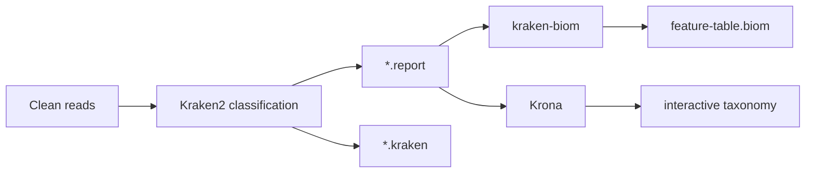

# Pipeline Foundations

MICOS-2024 should be read as a staged metagenomic evidence pipeline. The repository is not only a collection of tools, it is an attempt to standardize how raw read data becomes interpretable biological output.

## Why this section exists

Many documentation sites jump straight into installation or commands. That helps operators, but it does not help a reviewer understand the logic of the system. This section frames the conceptual model first:

1. what goes in,
2. what transforms it,
3. what comes out,
4. what each output can and cannot support analytically.

## Pipeline stages at a glance

| Stage | Core tools | Main objective | Primary outputs |
| --- | --- | --- | --- |
| Quality control | FastQC, KneadData | Remove technical noise and host contamination | Clean reads, QC summaries |
| Taxonomic profiling | Kraken2, kraken-biom, Krona | Convert reads into taxonomic evidence | Reports, BIOM table, interactive taxonomy view |
| Diversity analysis | QIIME2, Phyloseq-facing outputs | Estimate ecological differences across samples | Alpha and beta diversity artifacts |
| Functional readout | HUMAnN-oriented workflow and helper scripts | Infer pathway or gene-family signals | Functional abundance tables |
| Summarization | HTML report generation | Package outputs into reviewable deliverables | Report-ready result directories |

## Stage 1, quality control

The first stage is about defensibility. Reads that still contain adapters, low-quality segments, or host contamination produce downstream bias. In MICOS-2024 this concern is represented through:

- CLI-level quality control execution,
- WDL steps for FastQC and KneadData,
- configuration templates for quality thresholds and host databases.

The purpose is not only cleaner input, but cleaner interpretation later.

## Stage 2, taxonomic profiling

This is the strongest visible branch in the current codebase. Kraken2 reports, BIOM conversion, and Krona visualization form a coherent sub-pipeline with clear deliverables.

### Interpretation note

Taxonomic profiling gives ranked evidence, not absolute biological truth. Confidence thresholds, database choice, and contamination handling still shape the result.

## Stage 3, diversity analysis

Diversity analysis is where abundance evidence becomes ecological interpretation. QIIME2-oriented outputs allow readers to ask:

- how rich each sample is,
- how evenly abundance is distributed,
- how far communities are from one another,
- whether cohort or metadata groupings explain that distance.

The important architectural point is that this stage depends on cleaner upstream outputs and trustworthy metadata joins.

## Stage 4, functional readout

The repository carries both a stable CLI functional annotation command and broader script-level functional ambitions. From a reviewer perspective, that means MICOS-2024 spans two layers:

- a narrower stable interface,
- a wider experimentation and expansion surface.

The docs keep those layers distinct to avoid overstating maturity.

## Stage 5, summarization

A platform becomes usable when its outputs become navigable. Summarization is therefore not cosmetic. It is the layer where technical execution turns into a deliverable another scientist or reviewer can inspect.

## Reading strategy

If you are new to the repository:

1. read this page,
2. continue to **Data Products and Interpretation**,
3. then switch to **System Overview** in the Architecture section.

That order mirrors how the repository itself should be understood.
