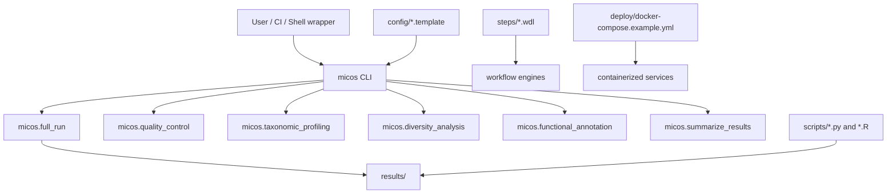

# System Overview

MICOS-2024 is architecturally interesting because it spans several execution layers without collapsing them into a single implementation style. The repository contains a stable Python CLI core, shell compatibility wrappers, workflow assets, container definitions, and specialist scripts.

## Architectural thesis

The project is best modeled as a **platform shell around microbiome tools**, not as a monolith with one execution engine.

## Layer map

| Layer | Key paths | Responsibility | Stability signal |
| --- | --- | --- | --- |
| Entry commands | `micos/cli.py`, `pyproject.toml` | Human-facing and automation-facing command surface | Highest |
| Python orchestration | `micos/*.py` | Compose quality control, taxonomy, diversity, functional annotation, and summarization | High |
| Shell wrappers | `scripts/run_full_analysis.sh`, `scripts/run_module.sh` | Backward-compatible convenience surfaces | Medium |
| Workflow assets | `steps/**/*.wdl` | Step-level portable workflow definitions | Medium |
| Environment assets | `deploy/`, `containers/singularity/` | Reproducible execution environments | Medium |
| Specialist scripts | `scripts/*.py`, `scripts/*.R` | Extended analyses beyond the stable CLI core | Variable |

## System boundaries

The documentation deliberately separates three concepts that are often blurred:

1. **stable interface**: what users can reasonably depend on now,
2. **integration assets**: what helps run the system in broader environments,
3. **exploration surface**: what expands the analytical horizon, but may not carry the same API guarantees.

## Architecture diagram

## What this means for contributors

If you modify the CLI, you are changing the most visible contract in the project.

If you modify the shell wrappers, you are working on a compatibility surface whose responsibility is to delegate cleanly to the CLI.

If you modify workflow or container assets, you are affecting reproducibility posture more than command semantics.

## Design principles surfaced by the repository

### 1. Reproducibility over cleverness

The repository prefers explicit workflow and environment artifacts. That is a sensible stance for bioinformatics systems where hidden environment state causes scientific and operational drift.

### 2. Layered growth

The codebase shows evidence of gradual expansion: first a core pipeline, then scripts for adjacent analyses, then more templates and assets around it. The docs should mirror that growth honestly.

### 3. Separation of operational and experimental surfaces

This is one of the most important distinctions in the project. The stable CLI path is relatively narrow. The repository ambition is broader. Good documentation makes both visible without pretending they are the same thing.
