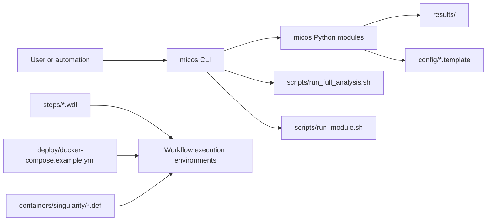

  <SiteHero
    eyebrow="Open-source metagenomics whitepaper"
    title="MICOS-2024"
    lede="A documentation experience rebuilt as a technical brief: not a checklist of commands, but a guided map of how this repository turns raw sequencing input into reproducible, reviewable microbiome analysis outputs."
    caption="The site is optimized for demanding readers: interviewers, maintainers, and senior open-source engineers evaluating whether the project is coherent beyond its README."
    :pills="heroPills"
    :actions="heroActions"
  >
    

      <h3>What this site emphasizes</h3>
      
Repository truth, execution boundaries, architecture intent, and research lineage.

    

    

      <h3>What is deliberately surfaced</h3>
      
The current stable CLI core, the broader workflow assets, and the gap between ambition and implemented runtime surface.

    

    

      <h3>How to read it</h3>
      
Start in Academy, then move into Architecture, then drop into Guides or Research depending on whether you are operating or auditing.

    

  </SiteHero>

  <MetricGrid :items="metrics" />

  <SiteSection
    eyebrow="Pipeline narrative"
    title="The platform is easier to trust when the execution chain is visible."
    lede="MICOS-2024 is best understood as an analysis story with four checkpoints: input hygiene, taxonomic evidence, ecological interpretation, and report-facing outputs."
  >
    

      <ThemeAsset
        light="/illustrations/pipeline-overview-light.svg"
        dark="/illustrations/pipeline-overview-dark.svg"
        alt="Pipeline overview illustration"
        caption="Theme-aware illustration for the full data path, designed to stay readable in both light and dark modes."
      />
      

        

          <strong>Reader signal</strong> 
          The pipeline is presented as a sequence of evidence transformations, not just a list of tools.
        

        

          <strong>Engineering signal</strong> 
          The repository carries both stable CLI entrypoints and broader workflow assets. This site distinguishes them instead of flattening everything into one surface.
        

        

          <strong>Operational signal</strong> 
          Several advanced analyses live under <code>scripts/</code> as specialist tools. They matter, but they are not described as part of the same stability contract as the CLI core.
        

      

    

    <FlowStageGrid :stages="stages" />
  </SiteSection>

  <SiteSection
    eyebrow="System anatomy"
    title="Repository layers, not just pages"
    lede="A reviewer should be able to map the docs to the codebase: entry commands, Python modules, workflow definitions, configuration templates, containers, and validation surfaces."
  >
    

      <ThemeAsset
        light="/illustrations/runtime-topology-light.svg"
        dark="/illustrations/runtime-topology-dark.svg"
        alt="Runtime topology illustration"
        caption="The project operates across a CLI layer, Python orchestration modules, workflow assets, and power-user scripts."
      />
      

        

          <h3>Stable core</h3>
          
<code>micos/cli.py</code> exposes <code>full-run</code>, <code>validate-config</code>, and module-level commands for quality control, taxonomy, diversity, functional annotation, and summarization.

        

        

          <h3>Workflow assets</h3>
          
<code>steps/</code>, <code>deploy/</code>, and <code>containers/</code> extend the platform into reproducible environments and step-level orchestration patterns.

        

        

          <h3>Research posture</h3>
          
The project benefits from established microbiome tooling, then attempts to wrap it into a more coherent end-to-end suite. That lineage is explicit in the Research section.

        

      

    

  </SiteSection>

  <SiteSection
    eyebrow="Execution chain"
    title="A quick mental model"
    lede="The runtime stack spans more than one abstraction level. This diagram makes the split explicit so contributors and reviewers can reason about where each concern lives."
  >

  </SiteSection>

  <SiteSection
    eyebrow="Research grounding"
    title="The project inherits credibility from the ecosystem it assembles."
    lede="MICOS-2024 is not a blank-slate invention. It is an integration effort sitting on top of well-cited microbiome tooling. That is a strength, and this site treats it as one."
  >
    <ReferenceList :items="references" />
  </SiteSection>

