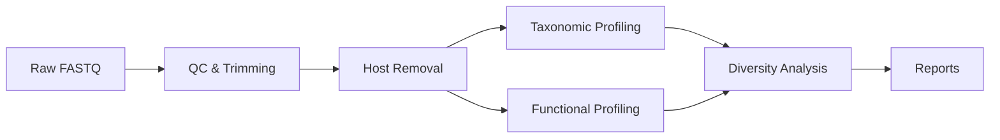

  

    
MC

    

      MICOS-2024
      Metagenomic Intelligence Suite
    

  

  

    <a href="./guides/getting-started">Guides</a>
    <a href="https://github.com/LessUp/micos-2024">GitHub</a>
    <a href="../zh/">中文</a>
  

  

    MICOS-2024 is a comprehensive metagenomic analysis platform that integrates taxonomic profiling, functional annotation, and diversity analysis into a unified workflow. Containerized and reproducible.
  

  

    <strong>6+</strong> modules
    <strong>10+</strong> tools
    <strong>100%</strong> reproducible
  

## Core Modules

  

    
🧬 Taxonomic Profiling

    

      Species-level classification using Kraken2, Bracken, and MetaPhlAn with confidence scoring.
    

    

      <a href="./analysis/taxonomic-profiling" class="feature-tag">Kraken2</a>
      <a href="./analysis/taxonomic-profiling" class="feature-tag">Bracken</a>
    

  

  

    
🔬 Functional Annotation

    

      Gene prediction, pathway analysis, and antimicrobial resistance gene detection.
    

    

      <a href="./analysis/functional-profiling" class="feature-tag">HUMAnN</a>
      <a href="./analysis/functional-profiling" class="feature-tag">eggNOG</a>
    

  

  

    
📊 Diversity Analysis

    

      Alpha and beta diversity metrics, ordination plots, and statistical comparisons.
    

    

      <a href="./analysis/diversity-analysis" class="feature-tag">Alpha</a>
      <a href="./analysis/diversity-analysis" class="feature-tag">Beta</a>
    

  

  

    
✅ Quality Control

    

      Read trimming, host removal, and quality filtering with FastP and Bowtie2.
    

    

      <a href="./guides/getting-started" class="feature-tag">FastP</a>
      <a href="./guides/getting-started" class="feature-tag">Bowtie2</a>
    

  

  

    
⚙️ WDL Workflows

    

      Portable workflow definitions compatible with Cromwell, miniWDL, and Terra.
    

    

      <a href="./configuration" class="feature-tag">WDL</a>
      <a href="./configuration" class="feature-tag">Cromwell</a>
    

  

  

    
🐳 Containerized

    

      Docker and Singularity support for fully reproducible analysis environments.
    

    

      <a href="./guides/getting-started" class="feature-tag">Docker</a>
      <a href="./guides/getting-started" class="feature-tag">Singularity</a>
    

  

  
Quick Start

  

    

      <code>python -m micos.cli full-run --input-dir data/raw_input --results-dir results --threads 16</code>
    

    See <a href="./guides/getting-started">Getting Started</a> for installation and detailed usage.
  

## Analysis Pipeline

## Performance Benchmarks

| Dataset Size | Reads | Threads | Time | Peak Memory |
|:---:|:---:|:---:|:---:|:---:|
| Small | 1M | 8 | ~15 min | 4 GB |
| Medium | 10M | 16 | ~1 hour | 16 GB |
| Large | 100M | 32 | ~6 hours | 64 GB |

---

MIT License - [LessUp](https://github.com/LessUp)
