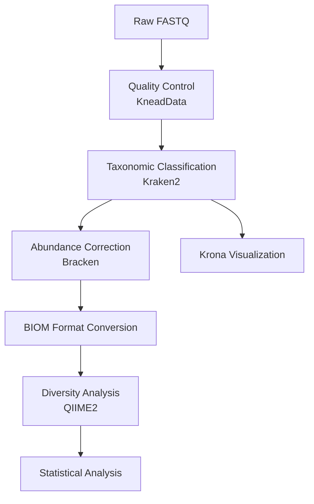

# Taxonomic Profiling

Complete guide to taxonomic classification and diversity analysis using MICOS-2024.

---

## Table of Contents

- [Overview](#overview)
- [Methodology](#methodology)
- [Workflow](#workflow)
- [Input Requirements](#input-requirements)
- [Running the Analysis](#running-the-analysis)
- [Parameter Configuration](#parameter-configuration)
- [Output Files](#output-files)
- [Result Interpretation](#result-interpretation)
- [Advanced Topics](#advanced-topics)
- [Troubleshooting](#troubleshooting)

---

## Overview

The taxonomic profiling module identifies and quantifies the microbial species present in your metagenomic samples. It integrates quality control, sequence classification, and diversity analysis into a comprehensive pipeline.

### Key Features

- **High-speed classification**: Kraken2 processes ~10M reads/minute
- **Accurate abundance estimation**: Bracken improves species-level quantification
- **Interactive visualization**: Krona charts for exploring taxonomic composition
- **Diversity metrics**: Alpha and beta diversity via QIIME2
- **Statistical analysis**: Differential abundance testing

---

## Methodology

### Classification Algorithm (Kraken2)

Kraken2 uses k-mer based classification:

1. **Database Construction**: Reference genomes are broken into k-mers (default k=35)
2. **Minimizer Indexing**: Reduces memory usage by storing minimizers only
3. **Classification**: Input reads matched against database using **LCA (Lowest Common Ancestor)** algorithm
4. **Confidence Scoring**: Classification confidence based on k-mer coverage

```
Read: ATCGATCGATCGATCGATCGATCG...
         ↓
K-mers: [ATCGATCGATCGATC], [TCGATCGATCGATCG], ...
         ↓
Database lookup → LCA assignment → Confidence score
```

### Abundance Correction (Bracken)

Bracken corrects for:
- **Genome size bias**: Larger genomes contribute more reads
- **Database coverage**: Incomplete reference databases
- **Strain variation**: Multiple strains of same species

### Taxonomic Ranks

| Rank | Code | Example |
|:---|:---:|:---|
| Domain | D | Bacteria |
| Phylum | P | Proteobacteria |
| Class | C | Gammaproteobacteria |
| Order | O | Enterobacterales |
| Family | F | Enterobacteriaceae |
| Genus | G | Escherichia |
| Species | S | Escherichia coli |

---

## Workflow



### Step-by-Step Process

1. **Quality Control**: Remove host DNA and low-quality reads
2. **Classification**: Assign reads to taxa using Kraken2
3. **Correction**: Estimate true abundances with Bracken
4. **Visualization**: Generate Krona interactive charts
5. **Diversity Analysis**: Calculate alpha/beta diversity metrics

---

## Input Requirements

### Data Format

| Format | Extension | Paired/Single |
|:---|:---|:---:|
| FASTQ (gzip) | `.fastq.gz` | Paired or Single |
| FASTQ | `.fastq` | Paired or Single |

### Naming Convention

```
Paired-end:
  Sample1_R1.fastq.gz
  Sample1_R2.fastq.gz

Single-end:
  Sample1.fastq.gz
```

### Quality Requirements

| Metric | Minimum | Recommended |
|:---|:---:|:---:|
| Read length | ≥ 50 bp | ≥ 100 bp |
| Quality score (Q30) | > 70% | > 85% |
| Depth per sample | 1M reads | 10M+ reads |

### Database Requirements

| Database | Size | Download |
|:---|:---:|:---|
| Kraken2 Standard | ~70 GB | [AWS Index](https://genome-idx.s3.amazonaws.com/kraken/) |
| Kraken2 PlusPF | ~100 GB | Includes fungi & protozoa |
| MiniKraken2 | ~8 GB | For testing |

---

## Running the Analysis

### Option 1: Complete Pipeline

```bash
python -m micos.cli full-run \
  --input-dir data/raw_input \
  --results-dir results \
  --threads 16 \
  --kneaddata-db /path/to/kneaddata_db \
  --kraken2-db /path/to/kraken2_db
```

### Option 2: Taxonomic Profiling Only

```bash
python -m micos.cli run taxonomic-profiling \
  --input-dir data/cleaned_reads \
  --output-dir results/taxonomy \
  --threads 16 \
  --kraken2-db /path/to/kraken2_db \
  --confidence 0.1
```

### Option 3: Manual Steps

```bash
# Step 1: Run Kraken2
kraken2 --db /path/to/kraken2_db \
  --paired sample_R1.fastq sample_R2.fastq \
  --output sample.kraken \
  --report sample.report \
  --confidence 0.1 \
  --threads 16

# Step 2: Run Bracken
bracken -d /path/to/kraken2_db \
  -i sample.report \
  -o sample.bracken \
  -r 150 \
  -l S

# Step 3: Convert to BIOM
kraken-biom *.report --fmt hdf5 -o feature-table.biom

# Step 4: Generate Krona
ktImportTaxonomy -o sample.krona.html sample.report
```

---

## Parameter Configuration

### Kraken2 Parameters

```yaml
taxonomic_profiling:
  kraken2:
    # Classification confidence (0.0 - 1.0)
    # Higher = more stringent, fewer classified reads
    confidence: 0.1
    
    # Minimum base quality for k-mer matching
    min_base_quality: 20
    
    # Minimum hit groups required
    min_hit_groups: 2
    
    # Use memory-mapped database (faster, more RAM)
    memory_mapping: true
    
    # Include scientific names in output
    use_names: true
```

### Confidence Threshold Selection

| Value | Sensitivity | Precision | Use Case |
|:---:|:---:|:---:|:---|
| 0.0 | Very High | Lower | Exploratory analysis |
| 0.1 | High | Good | **Default, balanced** |
| 0.3 | Moderate | High | Conservative analysis |
| 0.5 | Low | Very High | High confidence only |

### Bracken Parameters

```yaml
taxonomic_profiling:
  bracken:
    enabled: true
    
    # Read length (matches your data)
    read_length: 150
    
    # Taxonomic level for abundance
    # D, P, C, O, F, G, S
    level: "S"
    
    # Threshold for Bracken re-estimation
    threshold: 10
```

---

## Output Files

### Directory Structure

```
results/taxonomic_profiling/
├── raw/
│   ├── sample1.kraken      # Raw classification output
│   └── sample1.report      # Taxonomic report
├── bracken/
│   └── sample1.bracken     # Corrected abundances
├── krona/
│   └── sample1.krona.html  # Interactive visualization
└── biom/
    └── feature-table.biom  # QIIME2-compatible table
```

### Kraken2 Report Format

| Column | Description | Example |
|:---:|:---|:---|
| 1 | Percentage of reads | 56.32 |
| 2 | Number of reads (clade) | 563200 |
| 3 | Number of reads (direct) | 10000 |
| 4 | Rank code | S |
| 5 | NCBI TaxID | 562 |
| 6 | Scientific name | Escherichia coli |

**Rank codes**: D=Domain, P=Phylum, C=Class, O=Order, F=Family, G=Genus, S=Species

### Bracken Output Format

| Column | Description |
|:---|:---|
| name | Taxonomic name |
| taxonomy_id | NCBI TaxID |
| taxonomy_lvl | Taxonomic level |
| kraken_assigned_reads | Raw Kraken2 counts |
| added_reads | Estimated additional reads |
| new_est_reads | Total estimated reads |
| fraction_total | Proportion of total |

### BIOM Format

The BIOM file contains:
- **Observation IDs**: Taxa (e.g., k__Bacteria; p__Proteobacteria; ...)
- **Sample IDs**: Your sample names
- **Data**: Count matrix (samples × taxa)

---

## Result Interpretation

### Quality Metrics

#### Classification Rate

```bash
# Calculate classification percentage
# Look for: >70% classified at species level

grep -E "^\s+[0-9]+\s+[0-9]+\s+[0-9]+\s+[URS]" sample.report | \
  awk '{sum+=$2} END {print "Classified reads:", sum}'
```

| Classification Rate | Interpretation | Action |
|:---:|:---|:---|
| < 50% | High unclassified | Check database coverage, consider lower confidence |
| 50-70% | Moderate | Acceptable for most analyses |
| 70-90% | Good | Standard performance |
| > 90% | Excellent | High-quality data and good database coverage |

#### Taxonomic Composition

```bash
# Top genera
grep "^G" sample.report | sort -k1,1nr | head -10

# Top species
grep "^S" sample.report | sort -k1,1nr | head -10
```

### Krona Visualization

The Krona HTML allows:
- **Exploring taxonomic hierarchy**: Click to zoom in/out
- **Comparing samples**: Multiple reports in one chart
- **Exporting**: SVG/PNG export for publication

### Diversity Metrics

#### Alpha Diversity (Within Sample)

| Metric | Measures | Range | Notes |
|:---|:---|:---:|:---|
| Shannon | Diversity (richness + evenness) | 0 - ~7 | Higher = more diverse |
| Chao1 | Richness estimator | 0+ | Sensitive to rare taxa |
| Simpson | Evenness | 0-1 | Lower = more even |
| Observed Features | Raw richness | 0+ | Number of taxa |

**Typical values for human gut**:
- Shannon: 2.5-4.5
- Observed species: 50-200

#### Beta Diversity (Between Samples)

| Metric | Type | Use Case |
|:---|:---:|:---|
| Bray-Curtis | Abundance-based | Community composition |
| Jaccard | Presence/absence | Species overlap |
| UniFrac | Phylogenetic | Evolutionary distance |
| Weighted UniFrac | Abundance + phylogeny | Combined view |

---

## Advanced Topics

### Custom Database Creation

```bash
# Build custom Kraken2 database
kraken2-build --download-taxonomy --db custom_db
kraken2-build --add-to-library custom_genome.fa --db custom_db
kraken2-build --build --threads 16 --db custom_db
```

### Strain-Level Analysis

```yaml
# Use higher-confidence threshold for strain analysis
taxonomic_profiling:
  kraken2:
    confidence: 0.3
    use_names: true
```

### Time-Series Analysis

```bash
# Run with metadata for longitudinal analysis
python -m micos.cli run diversity-analysis \
  --input-biom feature-table.biom \
  --metadata metadata.tsv \
  --output-dir results/diversity
```

---

## Troubleshooting

### Issue: Low Classification Rate

**Symptoms**: <50% reads classified

**Solutions**:
```yaml
# 1. Lower confidence threshold
taxonomic_profiling:
  kraken2:
    confidence: 0.05

# 2. Use larger database
# Switch from MiniKraken to Standard

# 3. Check data quality
# Run FastQC on input reads
```

### Issue: Database Loading Slow

**Symptoms**: Kraken2 takes long time to start

**Solutions**:
```yaml
# Use memory mapping
taxonomic_profiling:
  kraken2:
    memory_mapping: true

# Or use SSD for database storage
```

### Issue: Empty Krona Charts

**Symptoms**: Krona HTML shows no data

**Solutions**:
```bash
# Check Kraken2 report format
head -5 sample.report

# Regenerate Krona
ktImportTaxonomy sample.report -o sample.krona.html
```

---

## See Also

- [Diversity Analysis](diversity-analysis.md) - Detailed diversity metrics
- [Functional Profiling](functional-profiling.md) - Functional analysis
- [Configuration Guide](configuration.md) - Parameter reference
