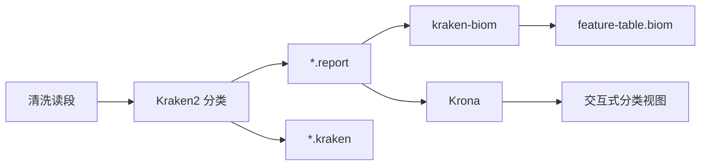

# 流程基础

MICOS-2024 将宏基因组输入一步步变成可解释的生物学结果。本页概述整体流程和各阶段目标。

## 流程总表

| 阶段 | 核心工具 | 目标 | 主要输出 |
| --- | --- | --- | --- |
| 质量控制 | FastQC, KneadData | 去除技术噪声与宿主污染 | 清洗读段、QC 摘要 |
| 物种分类 | Kraken2, kraken-biom, Krona | 生成分类学证据 | 报告、BIOM 表、交互式分类视图 |
| 多样性分析 | QIIME2 | 提取生态学差异 | Shannon / Bray-Curtis 产物 |
| 功能读出 | HUMAnN | 推断通路或功能特征 | 功能丰度表 |
| 结果汇总 | HTML 汇总模块 | 打包输出 | 报告级结果目录 |

## 第一阶段：质量控制

适配子、低质量碱基和宿主污染如果不处理，后面的分类和功能结果都会被放大偏差。FastQC 评估数据质量，KneadData 去除宿主污染。

## 第二阶段：物种分类

Kraken2 报告、BIOM 转换和 Krona 可视化组成分类分析分支：

分类结果是"证据排序"，不是无条件的生物学真相。数据库版本、置信度阈值和污染控制都会影响最终解释。

## 第三阶段：多样性分析

多样性分析把丰度证据转换成生态解释，回答样本内部有多丰富、不同样本之间差异有多大。当前集成 Shannon（Alpha）和 Bray-Curtis（Beta）两种指标。

## 第四阶段：功能读出

HUMAnN 将清洗读段映射到基因家族和代谢通路，生成功能丰度表。

## 第五阶段：结果汇总

汇总模块扫描 `results/` 目录，按阶段收集输出文件并生成 HTML 报告，方便快速查看分析结果。

## 推荐阅读顺序

1. 本页
2. [数据产物与解释](./data-products)
3. [系统总览](../architecture/system-overview)
