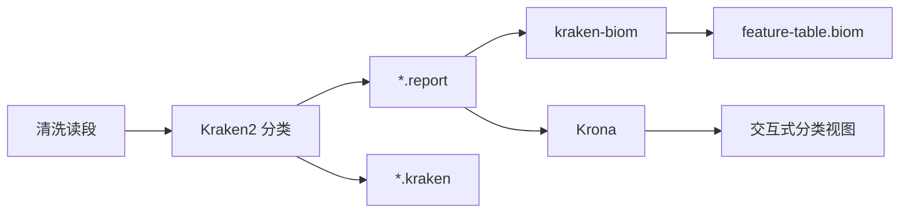

# 流程基础

理解 MICOS-2024，最好的方式不是先记命令，而是先看它如何把宏基因组输入一步步变成可解释的生物学结果。

## 为什么先讲这个

很多文档站一上来就给安装命令和参数表，这对操作者有帮助，但对评审者和维护者不够。这里先建立四个问题：

1. 输入是什么，
2. 中间经历了什么变换，
3. 最终产生什么产物，
4. 每类产物能支持什么分析判断。

## 流程总表

| 阶段 | 核心工具 | 目标 | 主要输出 |
| --- | --- | --- | --- |
| 质量控制 | FastQC, KneadData | 去除技术噪声与宿主污染 | 清洗读段、QC 摘要 |
| 物种分类 | Kraken2, kraken-biom, Krona | 生成分类学证据 | 报告、BIOM 表、交互式分类视图 |
| 多样性分析 | QIIME2, 面向 Phyloseq 的输出 | 提取生态学差异 | Alpha / Beta 多样性产物 |
| 功能读出 | 功能注释命令与辅助脚本 | 推断通路或功能特征 | 功能丰度表 |
| 结果汇总 | HTML 汇总模块 | 面向审阅者打包输出 | 报告级结果目录 |

## 第一阶段，质量控制

第一阶段的核心不是“预处理”这么简单，而是给后续所有推断建立可信边界。适配子、低质量碱基和宿主污染如果不处理，后面的分类和功能结果都可能被放大偏差。

## 第二阶段，物种分类

当前仓库里最成体系的一条主链路，就是 Kraken2 报告、BIOM 转换和 Krona 可视化组成的分类分析分支。

### 解读提醒

分类结果是“证据排序”，不是无条件的生物学真相。数据库版本、置信度阈值和污染控制都会影响最终解释。

## 第三阶段，多样性分析

多样性分析是把丰度证据转换成生态解释的关键步骤。它回答的是：

- 样本内部有多丰富，
- 群落组成有多均匀，
- 不同样本之间差异有多大，
- 元数据分组是否真的解释了这些差异。

## 第四阶段，功能读出

仓库同时存在稳定 CLI 功能注释入口与更宽泛的脚本层功能扩展。这意味着：

- 有一层更稳定的操作面，
- 也有一层更探索性的扩展面。

文档必须把这两层分开写，才不会夸大成熟度。

## 第五阶段，结果汇总

当分析结果能被另一个研究者或评审者快速看懂时，平台才真正可用。结果汇总因此不是“装饰层”，而是交付层。

## 推荐阅读顺序

如果你第一次接触仓库，建议按下面顺序读：

1. 本页，
2. **数据产物与解释**，
3. **系统总览**。

这条路径最接近仓库本身的逻辑结构。
