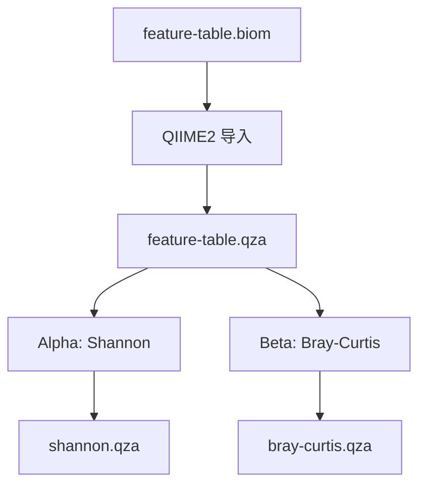

# 多样性分析

多样性分析将物种丰度表转化为生态学指标，揭示微生物群落的结构和差异。

## 概述

模块通过 QIIME2 计算两种多样性指标：

- **Alpha 多样性（Shannon 指数）**：度量单个样本内的物种多样性，同时考虑丰富度和均匀度
- **Beta 多样性（Bray-Curtis 相异度）**：度量样本间的群落组成差异

## 工作流程



## 运行分析

### 完整流程

在 `full-run` 中，多样性分析在物种分类之后自动执行，输入为 `results/taxonomic_profiling/feature-table.biom`。

### 仅多样性分析

```bash
micos run diversity-analysis \
  --input-biom results/taxonomic_profiling/feature-table.biom \
  --output-dir results/diversity_analysis
```

## 输出文件

```
results/diversity_analysis/
├── feature-table.qza     # QIIME2 特征表
├── shannon.qza           # Shannon Alpha 多样性
└── bray-curtis.qza       # Bray-Curtis Beta 多样性距离矩阵
```

## 结果解读

### Shannon 指数

Shannon 值越高表示样本内多样性越高。人类肠道样本的典型范围为 2.5-4.5，> 4 通常表示高多样性。

### Bray-Curtis 距离矩阵

距离值域为 [0, 1]，0 表示两个样本组成完全相同，1 表示完全不同。距离矩阵可用于后续的排序分析（如 PCoA）和组间差异检验（如 PERMANOVA），这些分析可通过 QIIME2 命令行或 `scripts/` 扩展脚本完成。

## 扩展指标

QIIME2 支持更多多样性指标（Simpson、Chao1、UniFrac 等）和排序分析（PCoA、NMDS）。MICOS-2024 当前仅集成 Shannon 和 Bray-Curtis，如需其他指标可直接操作生成的 `.qza` 文件。

## 相关文档

- [多样性度量](../algorithms/diversity-metrics.md) - 指标计算原理
- [物种分类](./taxonomic-profiling.md) - 上游分类分析
- [配置系统](../configuration.md) - 参数参考
