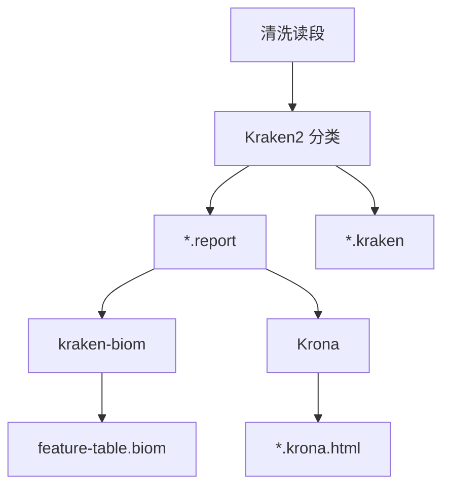

# 物种分类分析

物种分类模块识别并定量分析宏基因组样本中的微生物种类，将清洗后的读段转换为分类学证据。

## 概述

模块执行三步：Kraken2 分类 -> kraken-biom 转换 -> Krona 可视化。

- **Kraken2**：基于 k-mer 的快速分类
- **kraken-biom**：将报告转换为 BIOM 格式供下游分析
- **Krona**：生成交互式分类组成图

## 工作流程



## 输入要求

| 格式 | 扩展名 | 说明 |
|:---|:---|:---|
| FASTQ (gzip) | `.fastq.gz` | KneadData 清洗后的配对读段 |
| FASTQ | `.fastq` | KneadData 清洗后的配对读段 |

输入目录通常是 `results/quality_control/kneaddata/`，模块通过 `Sample.discover_cleaned()` 自动发现 `*_paired_1.fastq` / `*_paired_2.fastq` 文件。

## 运行分析

### 完整流程

```bash
micos full-run \
  --input-dir data/raw_input \
  --results-dir results \
  --threads 16 \
  --kneaddata-db /path/to/kneaddata_db \
  --kraken2-db /path/to/kraken2_db
```

### 仅物种分类

```bash
micos run taxonomic-profiling \
  --input-dir results/quality_control/kneaddata \
  --output-dir results/taxonomic_profiling \
  --threads 16 \
  --kraken2-db /path/to/kraken2_db \
  --confidence 0.1
```

### 置信度阈值

| 值 | 灵敏度 | 精确度 | 适用场景 |
|:---:|:---:|:---:|:---|
| 0.0 | 很高 | 较低 | 探索性分析 |
| 0.1 | 高 | 良好 | 默认，平衡 |
| 0.3 | 中等 | 高 | 保守分析 |
| 0.5 | 低 | 很高 | 仅高置信度 |

## 输出文件

```
results/taxonomic_profiling/
├── sample1.kraken          # Kraken2 原始分类输出
├── sample1.report          # Kraken2 分类报告
├── sample1.krona.html      # Krona 交互式分类视图
└── feature-table.biom      # 合并所有样本的 BIOM 丰度表
```

`feature-table.biom` 是多样性分析的输入。

## 结果解读

### 分类率

| 分类率 | 解读 | 操作 |
|:---:|:---|:---|
| < 50% | 高未分类率 | 检查数据库覆盖度，考虑降低置信度 |
| 50-70% | 中等 | 大多数分析可接受 |
| 70-90% | 良好 | 标准性能 |
| > 90% | 优秀 | 高质量数据和良好数据库覆盖 |

意外的高丰度物种可能指示污染，分类分布的异常偏斜需要调查。

## 相关文档

- [物种分类算法](../algorithms/taxonomic-classification.md) - Kraken2 k-mer 算法原理
- [多样性分析](./diversity-analysis.md) - 下游多样性分析
- [配置系统](../configuration.md) - 参数参考
