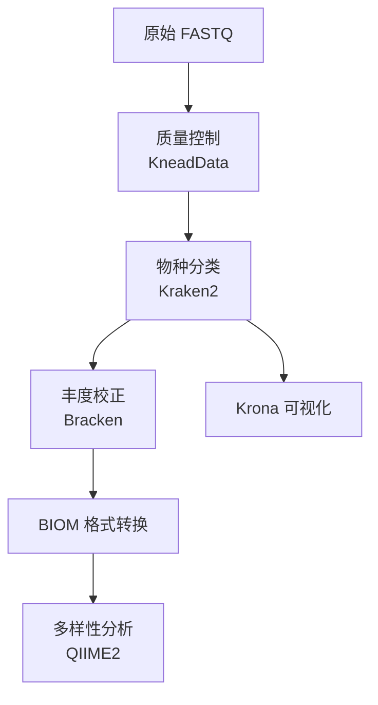

# 物种分类分析

MICOS-2024 物种分类与多样性分析完整指南。

---

## 概述

物种分类模块识别并定量分析宏基因组样本中的微生物种类。它将质量控制、序列分类和多样性分析整合为一个完整的分析流程。

### 核心特性

- **高速分类**: Kraken2 处理速度约 1000 万 reads/分钟
- **精确丰度估计**: Bracken 改善种水平定量
- **交互式可视化**: Krona 图表探索分类组成
- **多样性指标**: 通过 QIIME2 计算 Alpha 和 Beta 多样性

---

## 方法论

### 分类算法 (Kraken2)

Kraken2 使用 k-mer 进行分类：

1. **数据库构建**: 参考基因组被分解为 k-mers（默认 k=35）
2. **最小化索引**: 仅存储最小化子以减少内存使用
3. **分类**: 使用 **LCA（最近公共祖先）** 算法将输入 reads 与数据库匹配
4. **置信度评分**: 基于 k-mer 覆盖度计算分类置信度

### 分类层级

| 层级 | 代码 | 示例 |
|:---|:---:|:---|
| 域 | D | Bacteria |
| 门 | P | Proteobacteria |
| 纲 | C | Gammaproteobacteria |
| 目 | O | Enterobacterales |
| 科 | F | Enterobacteriaceae |
| 属 | G | Escherichia |
| 种 | S | Escherichia coli |

---

## 工作流程



---

## 输入要求

### 数据格式

| 格式 | 扩展名 | 配对/单端 |
|:---|:---|:---:|
| FASTQ (gzip) | `.fastq.gz` | 配对或单端 |
| FASTQ | `.fastq` | 配对或单端 |

### 质量要求

| 指标 | 最低值 | 推荐值 |
|:---|:---:|:---:|
| 读长 | ≥ 50 bp | ≥ 100 bp |
| 质量分数 (Q30) | > 70% | > 85% |
| 每样本测序深度 | 100 万 reads | 1000 万+ reads |

---

## 运行分析

### 方式 1: 完整流程

```bash
python -m micos.cli full-run \
  --input-dir data/raw_input \
  --results-dir results \
  --threads 16 \
  --kneaddata-db /path/to/kneaddata_db \
  --kraken2-db /path/to/kraken2_db
```

### 方式 2: 仅物种分类

```bash
python -m micos.cli run taxonomic-profiling \
  --input-dir data/cleaned_reads \
  --output-dir results/taxonomy \
  --threads 16 \
  --kraken2-db /path/to/kraken2_db \
  --confidence 0.1
```

---

## 参数配置

### Kraken2 参数

```yaml
taxonomic_profiling:
  kraken2:
    confidence: 0.1
    min_base_quality: 20
    memory_mapping: true
    use_names: true
```

### 置信度阈值选择

| 值 | 灵敏度 | 精确度 | 适用场景 |
|:---:|:---:|:---:|:---|
| 0.0 | 很高 | 较低 | 探索性分析 |
| 0.1 | 高 | 良好 | 默认，平衡 |
| 0.3 | 中等 | 高 | 保守分析 |
| 0.5 | 低 | 很高 | 仅高置信度 |

---

## 输出文件

### 目录结构

```
results/taxonomic_profiling/
├── raw/
│   ├── sample1.kraken
│   └── sample1.report
├── bracken/
│   └── sample1.bracken
├── krona/
│   └── sample1.krona.html
└── biom/
    └── feature-table.biom
```

---

## 结果解读

### 分类率

| 分类率 | 解读 | 操作 |
|:---:|:---|:---|
| < 50% | 高未分类率 | 检查数据库覆盖度，考虑降低置信度 |
| 50-70% | 中等 | 大多数分析可接受 |
| 70-90% | 良好 | 标准性能 |
| > 90% | 优秀 | 高质量数据和良好数据库覆盖 |

### Alpha 多样性典型值（人类肠道）

| 指标 | 范围 | 说明 |
|:---|:---:|:---|
| Shannon | 2.5-4.5 | >4 表示高多样性 |
| 观察物种数 | 50-200 | 随测序深度变化 |

---

## 故障排除

### 问题: 分类率低

```yaml
# 降低置信度阈值
taxonomic_profiling:
  kraken2:
    confidence: 0.05
```

### 问题: 数据库加载慢

```yaml
# 使用内存映射
taxonomic_profiling:
  kraken2:
    memory_mapping: true
```

---

## 相关文档

- [多样性分析](./diversity-analysis.md) - 详细多样性指标
- [功能注释](./functional-profiling.md) - 功能分析
- [配置指南](../configuration.md) - 参数参考
