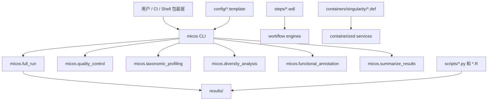

# 系统总览

MICOS-2024 的架构有意思的地方，在于它不是单一实现风格的仓库。它同时包含稳定 Python CLI、Shell 包装层、WDL 工作流资产、容器定义，以及一批扩展型分析脚本。

## 架构命题

这个项目更像是一个**围绕宏基因组工具栈搭建的平台外壳**，而不是一个只有单一执行引擎的单体系统。

## 分层地图

| 层级 | 关键路径 | 职责 | 稳定性信号 |
| --- | --- | --- | --- |
| 入口命令 | `micos/cli.py`, `pyproject.toml` | 面向用户和自动化的命令面 | 最高 |
| Python 编排 | `micos/*.py` | 串联质控、分类、多样性、功能注释、汇总 | 高 |
| Shell 包装层 | `scripts/run_full_analysis.sh`, `scripts/run_module.sh` | 向后兼容的便捷入口 | 中 |
| 工作流资产 | `steps/**/*.wdl` | 步骤级可移植工作流定义 | 中 |
| 环境资产 | `containers/singularity/` | 可重现运行环境 | 中 |
| 专家脚本 | `scripts/*.py`, `scripts/*.R` | 主 CLI 之外的扩展分析 | 可变 |

## 边界感为什么重要

文档在这里刻意区分三件事：

1. **稳定接口**，现在可以依赖什么；
2. **集成资产**，项目如何进入更大执行环境；
3. **探索扩展面**，哪些内容说明了平台 ambition，但不应被误读为同等级承诺。

## 架构图

## 对贡献者意味着什么

如果你修改 CLI，你在改最显眼的用户契约。

如果你修改 Shell 包装层，你应该把它当成“委托层”，而不是第二套流程实现。

如果你修改工作流或容器资产，你主要影响的是可重现性姿态，而不是命令语义本身。
