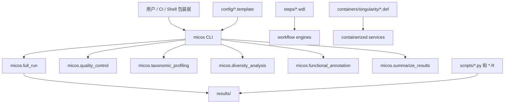

# 系统总览

MICOS-2024 是一个围绕宏基因组工具栈构建的 Python CLI 平台，串联质量控制、物种分类、多样性分析和功能注释五个阶段。仓库同时包含 WDL 工作流资产和 Singularity 容器定义，用于可重现部署。

## 分层地图

| 层级 | 关键路径 | 职责 |
| --- | --- | --- |
| 入口命令 | `micos/cli.py`, `pyproject.toml` | 面向用户和自动化的命令面 |
| Python 编排 | `micos/*.py` | 串联质控、分类、多样性、功能注释、汇总 |
| Shell 包装层 | `scripts/run_full_analysis.sh`, `scripts/run_module.sh` | 委托给 CLI 的便捷入口 |
| 工作流资产 | `steps/**/*.wdl` | 步骤级可移植工作流定义 |
| 环境资产 | `containers/singularity/` | 可重现运行环境 |
| 扩展脚本 | `scripts/*.py`, `scripts/*.R` | 主 CLI 之外的专家分析脚本 |

## 运行时拓扑

<ThemeAsset
  light="/illustrations/runtime-topology-light.svg"
  dark="/illustrations/runtime-topology-dark.svg"
  alt="运行时拓扑图"
  caption="项目横跨入口命令、Python 编排模块、工作流资产、配置模板与扩展分析脚本。"
/>

## 执行面

### 稳定 CLI 路径

主入口：

```bash
micos full-run --input-dir data/raw_input --results-dir results
```

`full-run` 串行执行五个阶段：质量控制 → 物种分类 → 多样性分析 → 功能注释 → 结果汇总。每个阶段也可以通过 `micos run <module>` 单独执行，支持 `--skip-*` 参数跳过指定阶段。

### Shell 包装路径

`scripts/run_full_analysis.sh` 和 `scripts/run_module.sh` 是薄包装层，委托给 CLI，不是独立的第二套流程实现。

### 工作流资产路径

`steps/` 中的 WDL 文件表达步骤级工作流关系，面向 workflow engine 集成，不是 CLI 的别名。

### 容器路径

`containers/singularity/*.def` 锁定执行环境。生信工具的失败常发生在环境边界而非算法边界，这一层用于消除环境漂移。

## 按职责划分

| 关注点 | 主负责层 | 辅助层 |
| --- | --- | --- |
| 命令体验 | `micos/cli.py` | shell wrappers |
| 流程编排 | `micos/full_run.py` | 其他 `micos/` 模块 |
| 可重现环境 | `containers/` | workflow assets |
| 配置模板 | `config/*.template` | CLI 配置加载 |
| 扩展分析 | `scripts/` | 结果目录 |

## 架构图



## 典型故障模式

### 配置不一致

分析模板、数据库模板和命令行参数三者之间没有对齐时运行会失败。先用 `micos validate-config` 检查。

### 环境漂移

容器、工作流和直接 CLI 描述的是不同现实时，可重现性会被削弱。文档按层分开说明，不混写。
