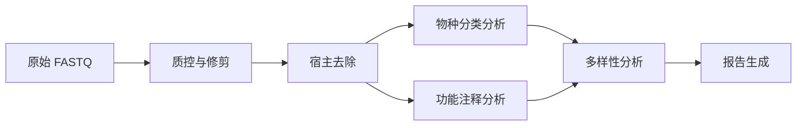

  

    
MC

    

      MICOS-2024
      宏基因组综合分析平台
    

  

  

    <a href="./guides/getting-started">指南</a>
    <a href="https://github.com/LessUp/micos-2024">GitHub</a>
    <a href="../en/">English</a>
  

  

    MICOS-2024 是一个综合宏基因组分析平台，将物种分类、功能注释和多样性分析整合到统一的工作流程中。支持容器化部署，确保分析结果完全可重现。
  

  

    <strong>6+</strong> 个模块
    <strong>10+</strong> 个工具
    <strong>100%</strong> 可重现
  

## 核心模块

  

    
🧬 物种分类分析

    

      基于 Kraken2、Bracken 和 MetaPhlAn 的物种级分类，支持置信度评分。
    

    

      <a href="./analysis/taxonomic-profiling" class="feature-tag">Kraken2</a>
      <a href="./analysis/taxonomic-profiling" class="feature-tag">Bracken</a>
    

  

  

    
🔬 功能注释分析

    

      基因预测、通路分析和抗性基因检测。
    

    

      <a href="./analysis/functional-profiling" class="feature-tag">HUMAnN</a>
      <a href="./analysis/functional-profiling" class="feature-tag">eggNOG</a>
    

  

  

    
📊 多样性分析

    

      Alpha 和 Beta 多样性指标、排序图和统计比较。
    

    

      <a href="./analysis/diversity-analysis" class="feature-tag">Alpha</a>
      <a href="./analysis/diversity-analysis" class="feature-tag">Beta</a>
    

  

  

    
✅ 质量控制

    

      使用 FastP 和 Bowtie2 进行读段修剪、宿主去除和质量过滤。
    

    

      <a href="./guides/getting-started" class="feature-tag">FastP</a>
      <a href="./guides/getting-started" class="feature-tag">Bowtie2</a>
    

  

  

    
⚙️ WDL 工作流

    

      可移植的工作流定义，兼容 Cromwell、miniWDL 和 Terra。
    

    

      <a href="./configuration" class="feature-tag">WDL</a>
      <a href="./configuration" class="feature-tag">Cromwell</a>
    

  

  

    
🐳 容器化部署

    

      支持 Docker 和 Singularity，确保分析环境完全可重现。
    

    

      <a href="./guides/getting-started" class="feature-tag">Docker</a>
      <a href="./guides/getting-started" class="feature-tag">Singularity</a>
    

  

  
快速开始

  

    

      <code>python -m micos.cli full-run --input-dir data/raw_input --results-dir results --threads 16</code>
    

    详见 <a href="./guides/getting-started">快速开始</a> 了解安装和详细用法。
  

## 分析流程

## 性能基准

| 数据规模 | Reads 数量 | 线程数 | 耗时 | 峰值内存 |
|:---:|:---:|:---:|:---:|:---:|
| 小型 | 1M | 8 | ~15 分钟 | 4 GB |
| 中型 | 10M | 16 | ~1 小时 | 16 GB |
| 大型 | 100M | 32 | ~6 小时 | 64 GB |

---

MIT 许可证 - [LessUp](https://github.com/LessUp)
