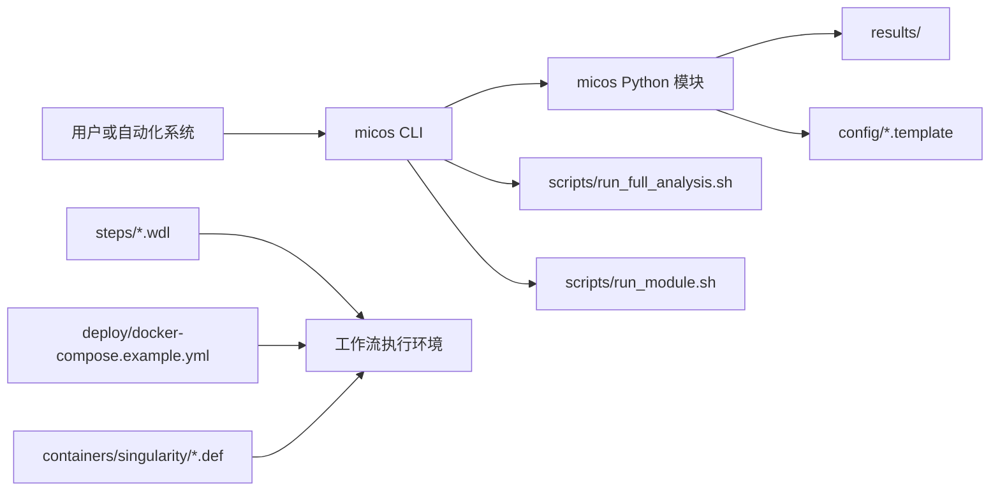

  <SiteHero
    eyebrow="开源宏基因组技术白皮书"
    title="MICOS-2024"
    lede="这不是传统意义上的命令说明书，而是一份面向严苛读者的项目导读：解释仓库如何把原始测序输入转化为可重现、可审查、可讨论的微生物组分析结果。"
    caption="站点被重构为评审导向的技术白皮书，用来回答两个关键问题：项目究竟做了什么，以及它为什么值得被认真看待。"
    :pills="heroPills"
    :actions="heroActions"
  >
    

      <h3>本站强调什么</h3>
      
仓库真实能力、运行边界、架构意图，以及其背后的科研工具谱系。

    

    

      <h3>本站刻意呈现什么</h3>
      
稳定 CLI 主链路、扩展型工作流资产，以及“目标蓝图”与“当前实现面”之间的差异。

    

    

      <h3>推荐阅读路径</h3>
      
先读学院，再看架构，随后按你的角色进入指南或研究部分，最后再回到具体模块页。

    

  </SiteHero>

  <MetricGrid :items="metrics" />

  <SiteSection
    eyebrow="流程叙事"
    title="当执行链路被看见，项目才更值得信任。"
    lede="MICOS-2024 最适合被理解为一个四段式证据流程：输入清洁、分类学证据、多样性解释，以及面向报告的最终产物。"
  >
    

      <figure class="micos-theme-asset">
        <PipelineOverview />
        <figcaption>使用 Vue SVG 组件实现零延迟主题切换，单一源维护。</figcaption>
      </figure>
      

        

          <strong>阅读信号</strong> 
          我们把流程写成“证据变换链”，而不是单纯罗列工具名字。
        

        

          <strong>工程信号</strong> 
          仓库同时存在稳定 CLI 入口与更宽泛的工作流资产，文档会明确区分，而不是混成一层。
        

        

          <strong>运行信号</strong> 
          多个高级分析仍位于 <code>scripts/</code> 中，属于专家扩展面，而非与主 CLI 相同稳定级别的接口承诺。
        

      

    

    <FlowStageGrid :stages="stages" />
  </SiteSection>

  <SiteSection
    eyebrow="系统剖面"
    title="不是只有页面，更要能映射回仓库层次。"
    lede="一个成熟的文档站应该让读者顺着页面直接定位到代码：入口命令、Python 模块、工作流定义、配置模板、容器资产以及验证面。"
  >
    

      <figure class="micos-theme-asset">
        <RuntimeTopology />
        <figcaption>项目的真实执行面分布在 CLI、Python 编排、工作流定义与扩展脚本之间。</figcaption>
      </figure>
      

        

          <h3>稳定核心</h3>
          
<code>micos/cli.py</code> 提供 <code>full-run</code>、<code>validate-config</code> 以及质量控制、分类、多样性、功能注释、结果汇总等命令。

        

        

          <h3>工作流资产</h3>
          
<code>steps/</code>、<code>deploy/</code> 与 <code>containers/</code> 把项目扩展到可重现执行环境和步骤级编排模式。

        

        

          <h3>研究姿态</h3>
          
MICOS-2024 的价值不在于重新发明底层算法，而在于把已有微生物组工具整合为一套更完整的分析体验，这一点在研究章节中被正面呈现。

        

      

    

  </SiteSection>

  <SiteSection
    eyebrow="执行链速记"
    title="一张图理解仓库的抽象分层"
    lede="项目跨越多个抽象层级，文档必须帮助读者判断每个职责究竟落在哪一层。"
  >

  </SiteSection>

  <SiteSection
    eyebrow="研究基底"
    title="项目的可信度，部分来自它继承了什么。"
    lede="MICOS-2024 不是无中生有，它站在成熟微生物组工具之上进行系统整合。把这种谱系写清楚，本身就是专业度的一部分。"
  >
    <ReferenceList :items="references" />
  </SiteSection>

